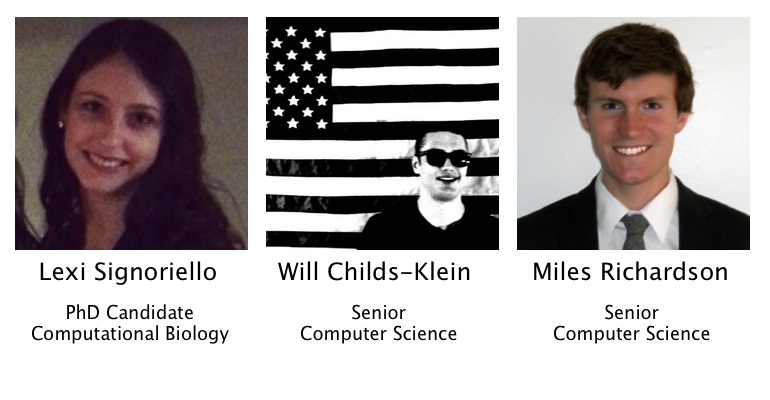

# Welcome, Pathways Students!

Thanks for coming to our workshop! You're here today because you want to learn
to code.

We only have two hours with you, so we won't be able to show you how to
build the next Facebook, but we will be able to show you that coding is
not as hard as you might think. By the end of the workshop, you should
having a working website that you can show to your friends and family.

Our goal is to give you the confidence that if you want to learn to code,
you can do it. It's not hard.

- [Welcome](#welcome-pathways-students)
    - [Instructors](#your-instructors-today)
    - [Agenda](#workshop-agenda)
- [Tutorial](#tutorial)
    - [Setup](#setup)
    - [Building Website](#building-website)
    - [Pushing Code](#pushing-code)

## Your Instructors Today

We started Code New Haven, which is an organization dedicated to teaching
high schoolers from New Haven how to code. This semester we have been
teaching a class at Metro Business Academy (MBA) how to code websites.

Here are some of the websites the MBA kids have made!

- <http://laavila.github.io/>
- <http://creeperfan5236.github.io/>
- <http://spectryn.github.io/mywebsite%20copy%202.HTML>
- <http://mynamesmari.github.io/ImarisWebsite.html>
- <http://deondre.github.io/cubes.html>
- <http://maxjoyner.github.io/cubes.html>
- <http://brittneyfuller.github.io/>

They're a work in progress, but a great start! By the end of today, you're
all going to have a website like this.

## Workshop Agenda

Start Time  | End Time| Content
------------- | -------------| -------------
3:00  | 3:15| Settle in, introductions, etc
3:15  | 3:45| Quick lecture, overview what you will do
3:45  | 4:00 | Break
4:00  | 5:00 | Build your website
